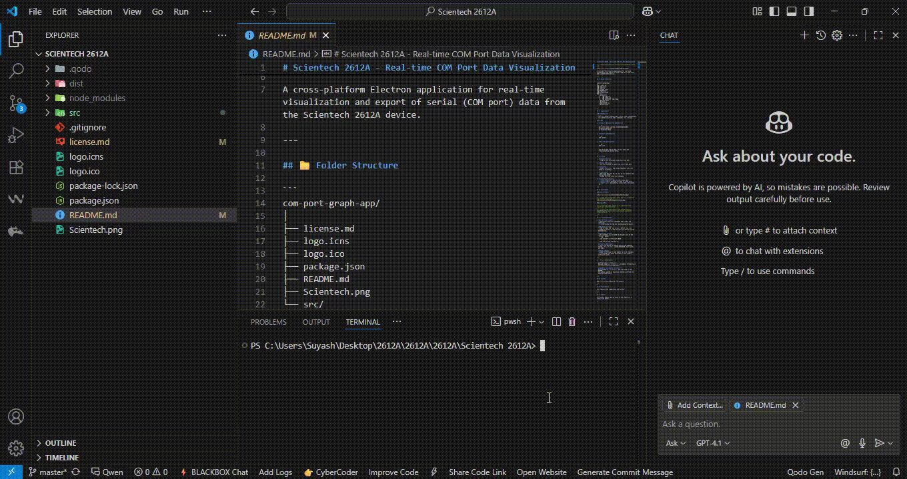
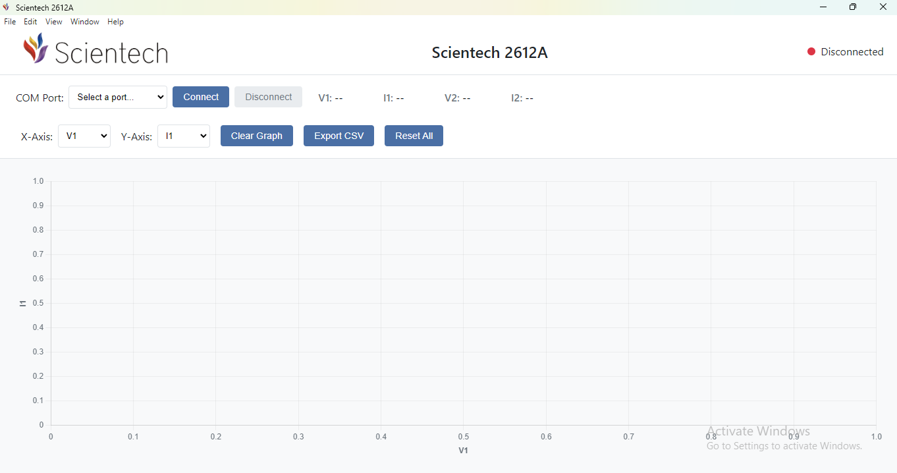
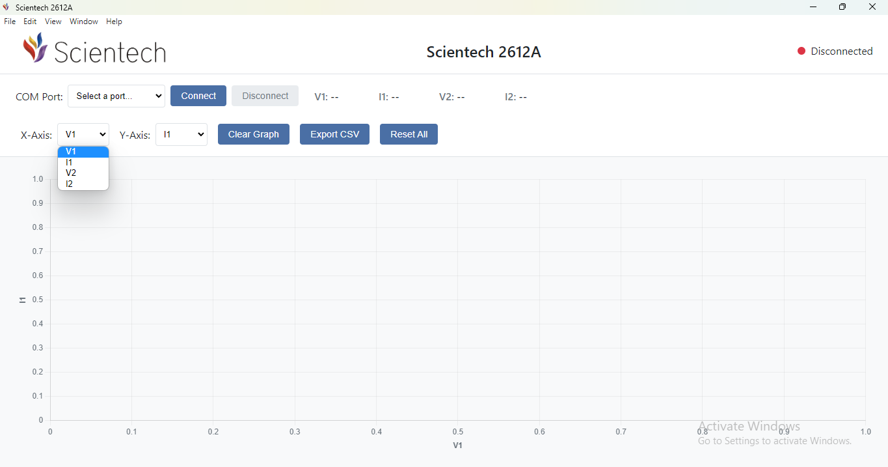

# Scientech 2612A - Real-time COM Port Data Visualization

<!--  -->


<!--  -->

A cross-platform Electron application for real-time visualization and export of serial (COM port) data from the Scientech 2612A device.

---

## 📁 Folder Structure

```
com-port-graph-app/
│
├── license.md
├── logo.icns
├── logo.ico
├── package.json
├── README.md
├── Scientech.png
└── src/
    ├── Assets/
    │   ├── logo.ico
    │   ├── logo2.ico
    │   └── Scientech logo-2.png
    ├── index.html
    ├── main.js
    ├── renderer.js
    └── style.css
```

---

## 🚀 Installation

### Prerequisites

- [Node.js](https://nodejs.org/) (v16 or later recommended)
- [Git](https://git-scm.com/) (optional, for cloning)

### Steps

1. **Clone or Download the Repository**

   ```sh
   git clone https://github.com/SuyashGautam05/Scientech-2612A.git
   cd Scientech 2612A
   ```

2. **Install Dependencies**

   ```sh
   npm install
   ```

3. **Run the Application**

   ```sh
   npm start
   ```

   The app window should open. If not, check the Troubleshooting section below.

---

## 🖥️ Usage

1. **Connect Device**
   - Plug in your Scientech 2612A device via USB.

2. **Select COM Port**
   - Use the dropdown to select the correct COM port.

3. **Connect**
   - Click **Connect**. The status indicator will turn green if successful.

4. **View Data**
   - Real-time data for V1, I1, V2, I2 will display and plot on the graph.
   - Change X/Y axes using the dropdowns.

5. **Clear/Export/Reset**
   - **Clear Graph**: Clears current graph data.
   - **Export CSV**: Download all data as a CSV file.
   - **Reset All**: Disconnects, clears data, and resets UI.

---

## 📸 Screenshots

### Main Interface


<!-- To add more screenshots, place them in `src/Assets/` and reference them here: -->


### Demo Video

<!-- To embed a video, upload it to a platform like YouTube and link/embed here: -->

<!-- [](https://www.youtube.com/watch?v=YOUR_VIDEO_ID) -->

---

## 🛠️ Troubleshooting

- **No COM Ports Listed**
  - Ensure your device is connected and drivers are installed.
  - Try restarting the app and reconnecting the device.

- **App Doesn't Start**
  - Make sure you ran `npm install` before `npm start`.
  - Check for errors in the terminal and resolve missing dependencies.

- **Permission Issues**
  - On Linux/Mac, you may need to add your user to the `dialout` group:
    ```sh
    sudo usermod -a -G dialout $USER
    ```
    Then log out and log back in.

- **Graph Not Updating**
  - Ensure the device is sending data in the expected format: `V1,I1,V2,I2\n` (comma-separated, four values per line).

- **Other Issues**
  - Check the terminal or app window for error messages.
  - Try running with admin privileges if you suspect permission issues.

---

<!-- ## 📝 Customization -->

- **Change Logo or Images:**  
  Replace images in `src/Assets/` and update references in [src/index.html](src/index.html).

- **Add More Screenshots or Videos:**  
  Place images in `src/Assets/` and link them in this README.  
  For videos, upload to YouTube or another platform and embed as shown above.

---

## 📄 License

See [license.md](license.md) for details.

---

## 🤝 Contributing

Pull requests and suggestions are welcome!

---

## 📬 Support

For issues, please open an issue on the repository or contact the author.

---
